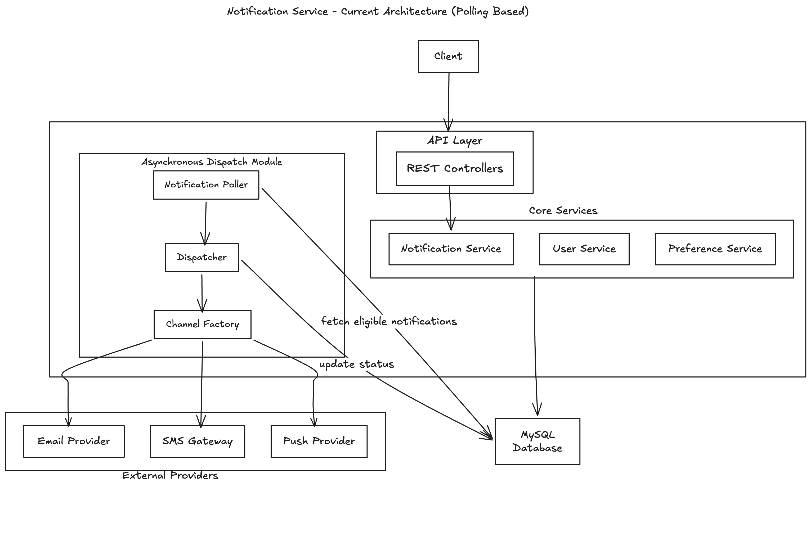
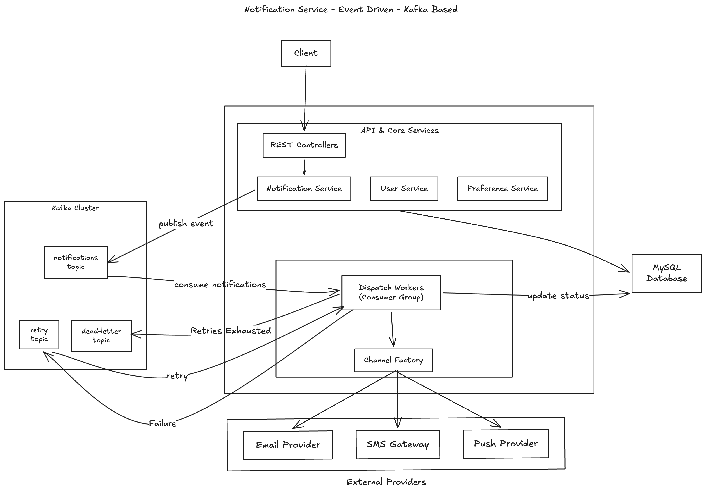
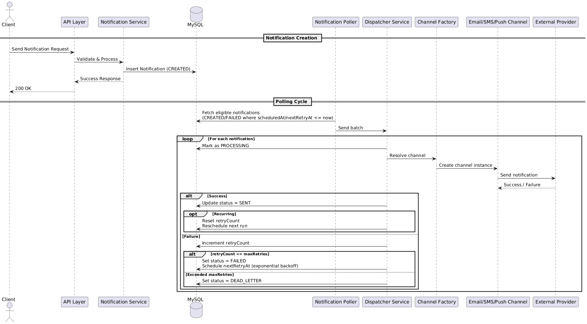
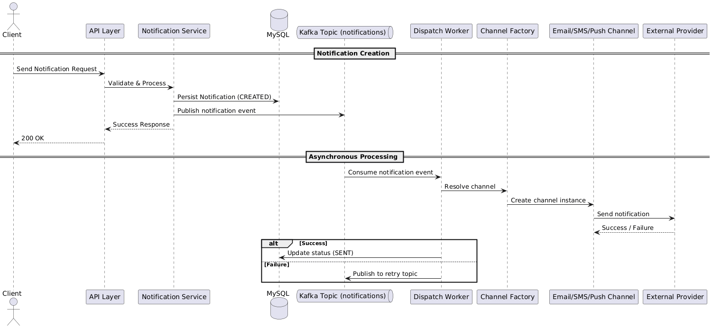

# Notification Service

A scalable and extensible notification service built using Spring Boot.  
The system supports priority-based scheduling, configurable retry strategies, bulk ingestion, recurring notifications, and multi-channel delivery (Email, SMS, Push).

---

## 1. Overview

This service is designed to handle notification workflows reliably at scale.  
It separates ingestion from dispatch logic and provides configurable retry policies along with user-level channel preferences.

The architecture emphasizes modularity, extensibility, and clean separation of concerns.

The system is designed to support high-volume workloads while remaining extensible for additional channels and distributed deployment models.

---

## 2. Core Features

- Priority-based processing (HIGH, MEDIUM, LOW)
- Scheduled notifications
- Configurable retry mechanism per channel
- Dead letter handling after retry exhaustion
- Bulk notification ingestion with partial success handling
- Multi-channel delivery (Email, SMS, Push)
- User channel enable/disable preferences
- Optional recurring notifications
- Paginated tracking API
- Unit test coverage ~77% (50+ test cases and 100% of service layer)

---
## 3. Architecture

### 3.1 High-Level Architecture (Current - Polling Based)

The current implementation uses a database-driven polling mechanism for dispatch.

- Notifications are persisted in MySQL.
- A scheduled poller retrieves eligible notifications.
- The dispatcher processes notifications via channel-specific implementations and updates their status.

---

### 3.2 High-Level Architecture (Event-Driven - Kafka Based)

The event-driven architecture replaces polling with Kafka-based asynchronous processing.

- Notification creation publishes an event to Kafka.
- Dispatch workers consume events using a consumer group.
- Retry events are routed to a retry topic.
- A dead-letter topic handles exhausted retries.
- Workers update notification status in MySQL.

---

### 3.3 Layered Structure

The application follows a clean layered architecture to ensure separation of concerns, modularity, and testability:

- **Controller Layer** – Exposes REST APIs and handles request/response mapping.
- **Service Layer** – Contains business logic, validation, and orchestration.
- **Repository Layer** – Manages persistence using Spring Data JPA.
- **Database Layer** – MySQL storage for notifications, users, and preferences.

This structure allows independent evolution of API, business logic, and persistence layers.

---

### 3.4 Dispatch Pipeline

In the current polling-based implementation, notification delivery follows this pipeline:

NotificationPoller  
→ NotificationDispatcherService  
→ NotificationChannelFactory  
→ Channel Implementation (Email / SMS / Push)  
→ External Provider

The detailed runtime behavior of this pipeline is illustrated in the sequence diagrams below.

---

### 3.5 Key Components

**NotificationPoller**  
Periodically retrieves eligible notifications based on status (`CREATED` / `FAILED`), scheduled time, and priority ordering.

**NotificationDispatcherService**  
Executes delivery attempts, manages retry logic with exponential backoff, handles dead-letter transitions, and supports recurring scheduling.

**NotificationChannelFactory**  
Resolves the appropriate channel implementation dynamically based on the notification's channel type.

**Channel Implementations (Email / SMS / Push)**  
Encapsulate channel-specific behavior including endpoint validation and interaction with external providers.

**UserPreferenceService**  
Validates whether a particular notification channel is enabled for a given user.

**RetryProperties**  
Provides configurable maximum retry limits per channel via application configuration.

---

### 3.6 System Flow Summary

The end-to-end lifecycle of a notification in the current implementation:

1. Client submits a notification request.
2. The notification is validated and persisted with status `CREATED`.
3. Eligible notifications are selected based on scheduling and priority rules.
4. The dispatcher attempts delivery via the appropriate channel.
5. Status transitions based on outcome:
    - `SENT` on success
    - `FAILED` with a scheduled retry on transient failure
    - `DEAD_LETTER` if retries are exhausted.
---
## 4. Sequence Diagrams

### 4.1 Current Implementation (DB Polling Based)

The current implementation uses a polling-based scheduler that fetches eligible notifications from the database and dispatches them via channel-specific handlers.

---

### 4.2 Scaled Architecture (Kafka-Based Event-Driven Version)

For large-scale, distributed deployments, the polling mechanism can be replaced with an event-driven architecture using Kafka.

- Notification creation publishes an event to Kafka
- Multiple dispatch workers consume events
- Retry events are published to a retry topic
- Dead-letter topic handles exhausted retries

---

## 5. Priority Handling

Eligible notifications are selected using:

- Status filter (CREATED / FAILED)
- Scheduled time eligibility
- Sorted by:
    - priorityWeight DESC
    - createdAt ASC

This ensures higher priority notifications are processed first within the ready set.

---

## 6. Retry and Dead Letter Strategy

Each notification maintains:

- retryCount
- maxRetries
- nextRetryAt

On dispatch failure:
- retryCount increments
- nextRetryAt is scheduled

If retryCount exceeds maxRetries:
- Status transitions to DEAD_LETTER

Retry counts are configurable per channel.

Retry delay follows exponential backoff:

1st retry → 1 minute  
2nd retry → 2 minutes  
3rd retry → 4 minutes

Delay = 2^(retryCount - 1)

---

## 7. Bulk Ingestion

The bulk API:

- Accepts multiple notifications in a single request
- Enforces configurable maximum bulk size
- Supports partial success
- Returns accepted and rejected items separately

---

## 8. Recurring Notifications

If `recurrenceIntervalMinutes` is provided:

- After successful dispatch, the notification is rescheduled
- retryCount is reset
- Status remains CREATED

---

## 9. Technology Stack

- Java 17
- Spring Boot 3.2.10
- Spring Data JPA
- MySQL 8.3.0
- Flyway 9.22.3
- Maven 3.x
- Docker 24.x
- JUnit 5
- Mockito

---

## 10. Prerequisites

Before running the application, ensure the following are installed:

- Java 17+
- Maven 3.8+
- Docker & Docker Compose

---

## 11. Running the Application

### Step 1: Start MySQL (Docker)
docker-compose up -d

This starts a MySQL 8 container with the configured database.

### Step 2: Build the Project
mvn clean install

### Step 3: Run the Application
mvn spring-boot:run

Application runs at: http://localhost:8080
Default active profile: `dev`

---

## 12. API Documentation (Swagger)

When running with the `dev` profile:

Swagger UI: [http://localhost:8080/swagger-ui.html](http://localhost:8080/swagger-ui.html)

---

## 13. Testing

Run all unit tests: 

mvn test
Includes tests for:

- Service layer
- Dispatcher logic
- Poller
- Channel implementations
- Bulk validation
- Retry behavior
- Dead letter handling

---

## 14. Design Considerations

- Extensible channel design using factory pattern
- Retry logic isolated from controller layer
- Separation of ingestion and dispatch concerns
- Optimized database indexing for polling
- Configurable retry strategy per channel
- Designed to be horizontally scalable with distributed locking (future enhancement)

---
## 15. Assumptions & Trade-offs

- Single-instance deployment for current implementation.
- Database polling used instead of message queue for simplicity.
- Strong consistency preferred over eventual consistency.
- Channel providers are assumed to be idempotent.
- No distributed locking implemented in current version.
- At-least-once delivery guarantee (duplicate handling left to downstream systems).
- Exactly-once semantics would require idempotency and message broker support.

The Kafka-based architecture demonstrates how the system can evolve to a distributed, event-driven model.

## 16. Future Improvements

- Distributed locking or leader election for multi-instance deployments
- Migration to event-driven architecture using Kafka or similar message brokers
- Horizontal scaling with partitioned consumer groups
- Rate limiting and throttling per channel/provider
- Circuit breaker and resilience patterns (e.g., Resilience4j)
- Metrics, tracing, and observability integration (Prometheus / Grafana)
- Dead-letter queue monitoring and alerting
- Idempotency handling for duplicate event processing
- Class and ER diagrams

---

## Author

Natesh G N

